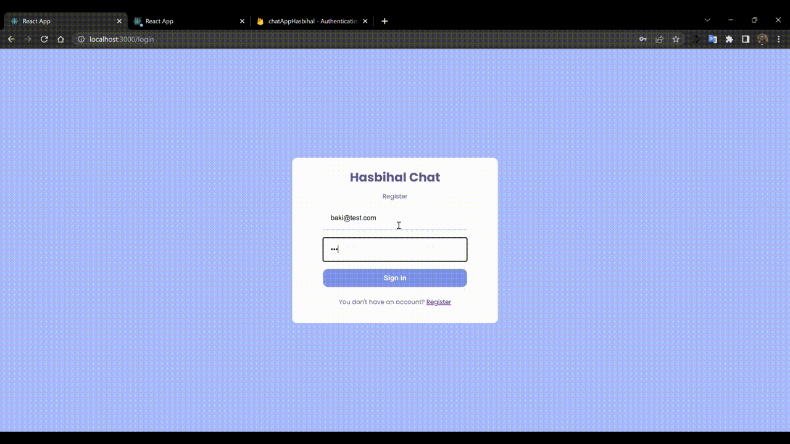

# Chat Application with Firebase database

## What I Practice

 - `SCSS` has been designed
 - Email password auth
 - Chat application currently available
 - details can be added
 
 ### `Deploy` 

 https://chatapp-firebasee.netlify.app/

### `Screen`  

  
